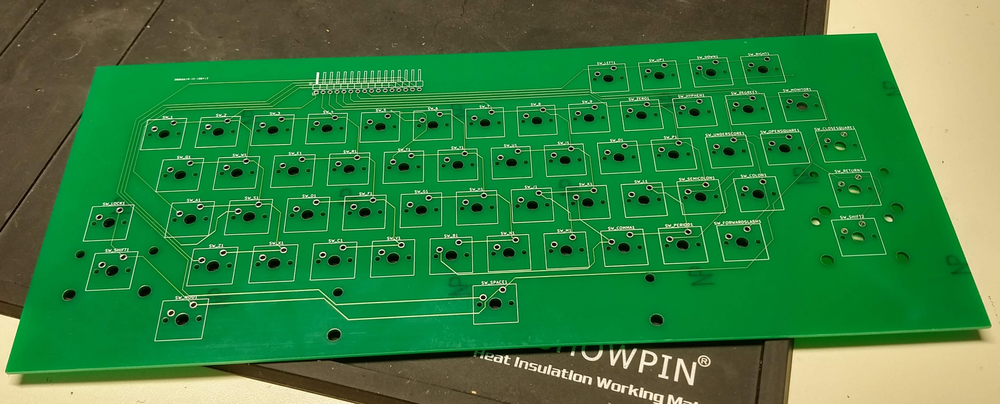
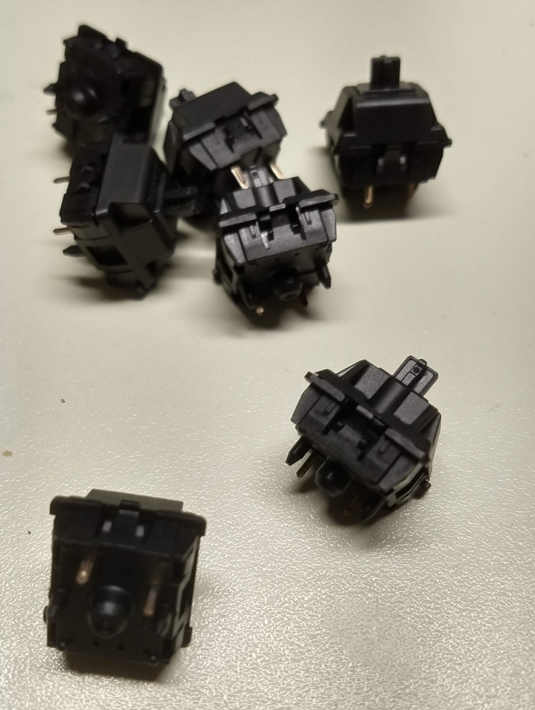
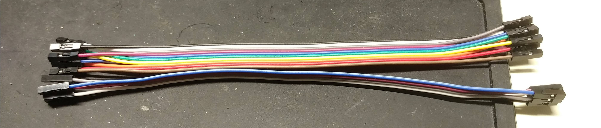
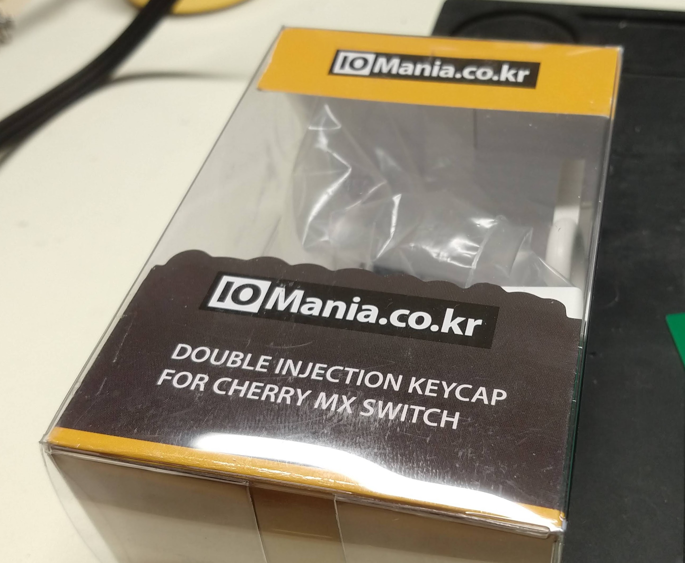

# TomyTutorKeyboard
A PCBoard design for replacing Tomy Tutor Computer keyboard.

## Status
This is tested. Works great.

## Files

Schematic is here based on KiCAD.

* gerbers - folder with the rendered gerbers
* tomy_tutor_keyboard.scad - OpenSCAD model design file for framing
* tomy_tutor_keyboard.stl - STL file output ready for your favority slicer

# BOM

## 1. Printed Circuit Board

You'll need the bare pcb, see the design files here in this repo.

## 2. 57 MX1A-11NW key switches or equivalent:

The pcboard footprint is specific to these switches. But there are some variety that have the same footprint.

[mouser switches](https://www.mouser.com/ProductDetail/540-MX1A-11NW)

## 3. set of key stabalizers for the wide keys:

[ebay stabalizers](https://www.ebay.com/itm/322528567052?ViewItem=&item=322528567052&ppid=PPX000608&cnac=US&rsta=en_US(en_US)&cust=1SW22173KD939402H&unptid=b421f75c-4e70-11e8-8929-441ea1472df0&t=&cal=b3a4b6dd50c6e&calc=b3a4b6dd50c6e&calf=b3a4b6dd50c6e&unp_tpcid=email-receipt-auction-payment&page=main:email&pgrp=main:email&e=op&mchn=em&s=ci&mail=sys)

## 4. Cable

16 female to female dupont style jumper wires

## 5. 16 pin single inline 2.54mm right angle header

The header on the keyboard pcb is mounted on the underside of the board with the right angle pins facing forward.

## 6. 16 pin single inline 2.54mm straight header

I desoldered and removed the existing film cable connector from the Tomy Tutor motherboard, and replaced it with a row of 16 2.54mm spaced headers.

## 7. Key caps

I used a set of PC keyboard keycaps with a diminutive print. If you can find some with no print, that would be closer to ideal. You'll never find ones that match the Tomy keyboard map.  I found mine on ebay.

## 8. Transparent adhesive printer sheet. 

I printed my key labels on a sheet of adhesive transparency with a laser printer. Then cut out each label and applied it to the keycaps after they were in place. Not the most ideal.

[amazon - Avery self adhesive laminating sheets](https://smile.amazon.com/gp/product/B00006IC7H/ref=ppx_yo_dt_b_search_asin_title?ie=UTF8&psc=1)

NOTE: with regret, I cannot find the document I created with the custom keycap labels...